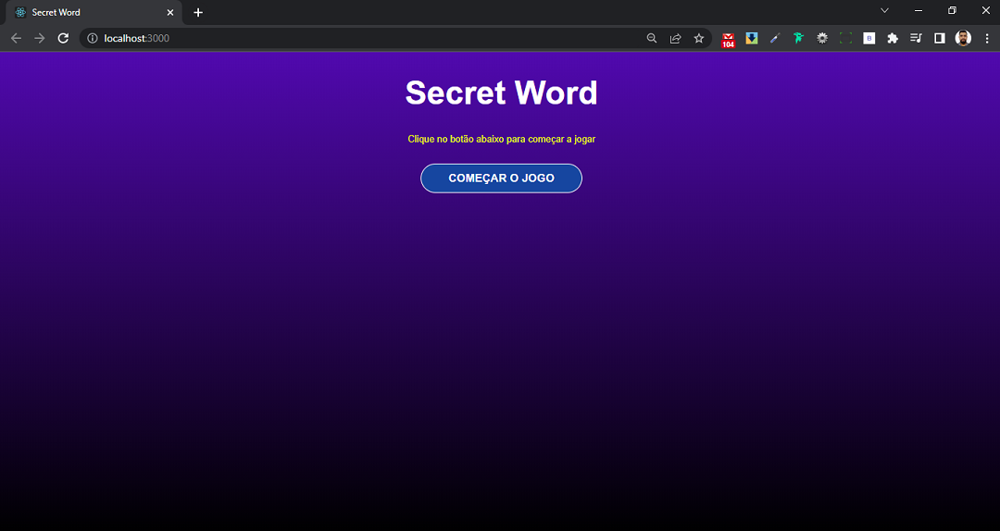
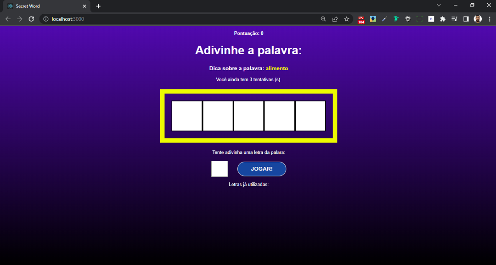
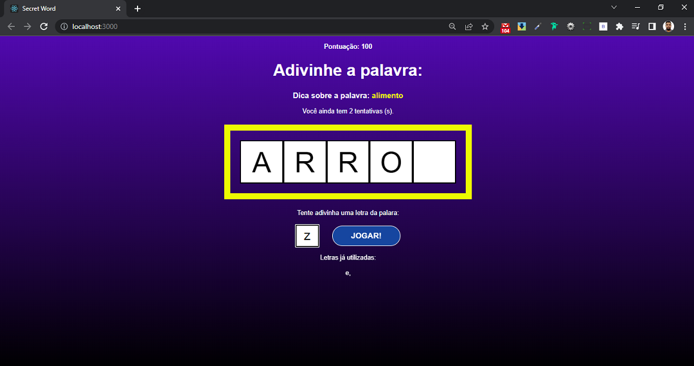
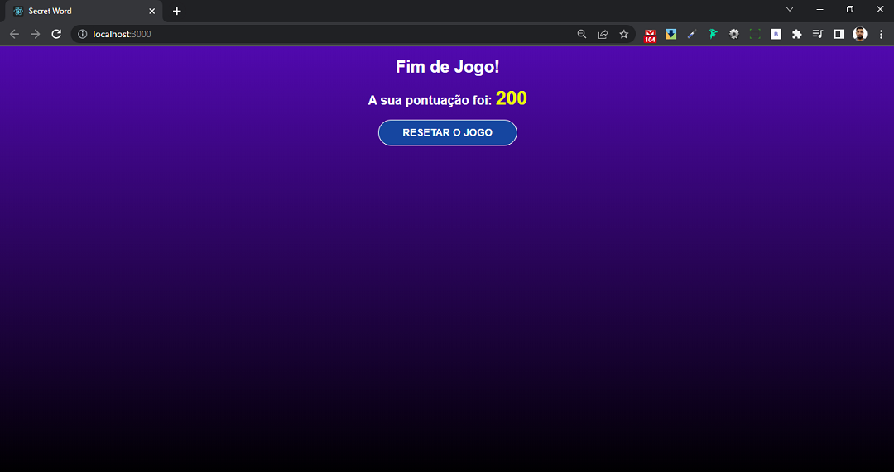
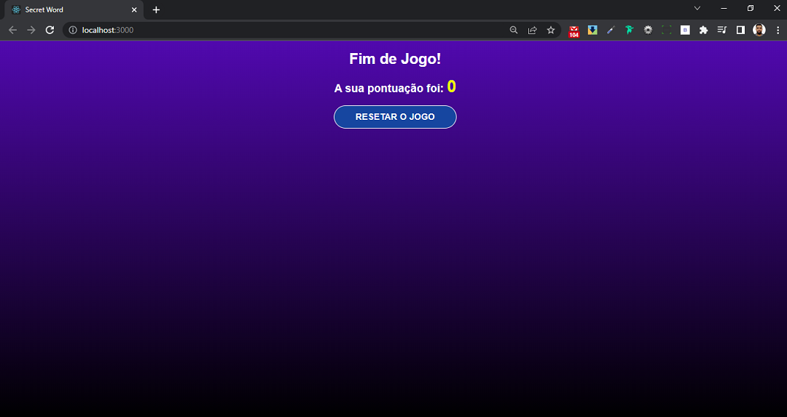

# Secret-Word
 Projeto Palavra secreta com React.

## Iniciando o projeto

No terminal digite `npm start`.
** React Live Development Server is listening on localhost:3000, open your browser on http://localhost:3000/ **
##

## Ambiente de Desenvolvimento

O desenvolvimento dessa aplicação foi em HTML5 e CSS3 para fazer a marcação e estilização da base do projeto e React com JavaScript para criar a lógica e animações do projeto.
## Histórico de Atualizações

    * Projeto inicial

## 🛠️ O projeto foi construido com

* [HTML5](https://developer.mozilla.org/en-US/docs/Web/HTML) - Estutura do projeto.
* [CSS3](https://developer.mozilla.org/en-US/docs/Web/CSS) - Styles do projeto.
* [React](https://pt-br.reactjs.org/) - criar a interface e animação do projeto.

## 📌 Versão

Usei [Git](https://git-scm.com/) para controle de versão. Para as versões disponíveis, observe as [tags neste repositório](https://github.com/JonathasRosa/Pokedex-2).

## ✒️ Autor

* **Um desenvolvedor** - *Trabalho Inicial* - [Jonathas Rosa](https://github.com/JonathasRosa)

## Redes sociais

##
Linkedin - [JonathasRosa](https://www.linkedin.com/in/jonathasrosa85/)
##
Instagram - [@jonathas_rosa85](https://www.instagram.com/jonathas_rosa85/)

## Licença

Distribuído sobre a licença. Veja `MIT License` para mais informações.

[https://github.com/JonathasRosa/Secret-Word/blob/main/LICENSE](https://github.com/JonathasRosa)

## 🎁 Expressões de gratidão

* Você gosstou do projeto? 
* Conte a outras pessoas sobre este projeto 📢;
* Convide alguém da equipe para uma cerveja 🍺;
* Agradeço publicamente a minha esposa Ingrid Mendez que me incentivou nessa jornada e a todas as outras pessoas que participaram do processo, desde os que me apresentaram a programação e todos os professores;
---
⌨️ com ❤️ por [Jonathas Rosa](https://github.com/JonathasRosa) 😊